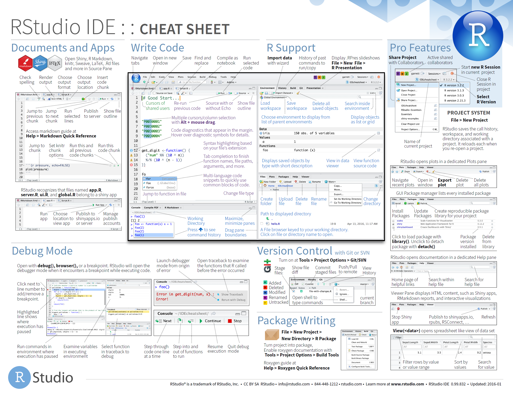

# Software {#software}

When developing R code which may be shared or executed by another person it is important to 
ensure everyone is using the same versions of software and packages. Differences in packages 
can produced unexpected results and all versions of packages are not compatible with all versions
of R.


## Core R Applications

The minimum software required to write R code is the R application itself. However, it is 
better to use a separate editor for creating R scripts. The recommended software installation 
is:

 - [R](https://cloud.r-project.org/): Use the latest version whenever possible. If older versions
   are required they can be installed side-by-side. Within RStudio, the version of R to use can be 
   selected in the Global Options. R can be used for Free.
 - [RStudio Desktop](https://www.rstudio.com/products/rstudio/download/): To edit R scripts 
   and manage projects. As with R use the latest version possible. RStudio can also be used for 
   free.
 - [RTools](https://cran.r-project.org/bin/windows/Rtools/): A set of tools required to build R 
   packages. You must make sure you have the version compatible with the most recent version of R
   installed. RTools can also be used for free.

RStudio provides a cheatsheet detailing commonly used functionality of its editor:

```{r rstudio-cheatsheet, echo=FALSE, fig.align='center', fig.cap='RStudio Cheat Sheet', out.width='80%'}

# https://github.com/rstudio/cheatsheets/raw/master/rstudio-ide.pdf
```


## Supporting Software

In addition to the above, when writing R code of medium (or high) complexity or criticality it is
recommended that version control is used:

 - [Git](http://gitforwindows.org/) is the market leader version control software and integrates 
   well with RStudio. Git is free.
 - [GitKraken](https://www.gitkraken.com/) provides a very good graphical interface to 
   Git and access to more features than RStudio. If you are working on complex projects with other 
   team members then consider using GitKraken. GitKraken is not free, but it does not cost very 
   much.
 - [GitHub](https://help.github.com/) is a hosting platform for Git repositories. It also allows 
   you to control access, formalise code reviews and plan projects.


## Package Versions

A common problem with R is ensuring everyone is using the same version of packages. The 
are a number of ways to deal with this problem:

 1. The simplest approach is to create a site library, a location on a network drive where 
    everyone has access to. The default library location can then be set to this location so
    everyone uses the same packages.
    
    The disadvantage of this approach is that if someone updates a packages it is updated 
    for everyone.
    
 1. Another option, which can be used with the first option, is to point everyone's R installation 
    to a snapshot of CRAN. This ensures that everyone installs packages released at a specified 
    date. This can be achieved using either:
    
    - Microsoft's [Time Machine](https://mran.microsoft.com/timemachine) allows you select the 
      version of CRAN to used based on a date.
    
    - RStudio's [Package Manager](https://www.rstudio.com/products/package-manager/) allows you to
      select a version of CRAN based on an ID. RStudio Package Manager is installed on premise and
      also allows the company to control the packages that can be installed.
    
 1. The most flexible approach is to use [packrat](development.html#packrat) when developing 
    projects or packages. Packrat allows you to specify which versions of dependent packages you 
    use for the project, and ensures that everyone using it also uses the same versions of 
    the packages.
