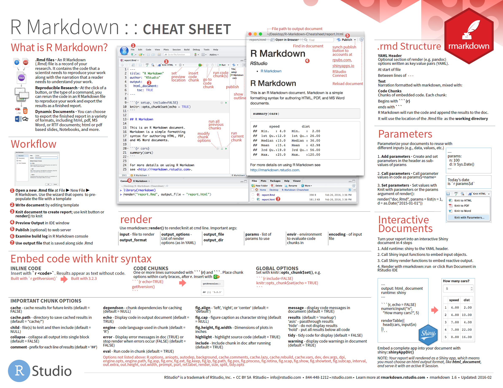

# Writing R Code {#writing}

## Writing Style

When writing code it is important to follow a common style so it is readable and other people, and your future self, can easily understand and extend it.

### Tidyverse

It is recommended, when using R, that we use the "[Tidyverse](https://www.tidyverse.org/)" approach and packages wherever possible. The Tidyverse is a collection of packages designed for data science, as well as a philosophy and style for formatting data and writing functions. The [tidyverse.org](https://www.tidyverse.org/) website details the packages involved and contains articles on how to use them. Some of it will be summarised below, but the website contains the definitive information.

The most in-depth treatment on the Tidyverse can be found in the book *R for Data Science*, which is available online for free at [r4ds.had.co.nz](http://r4ds.had.co.nz/).

The tidyverse has an extensive [style guide](http://style.tidyverse.org/), which we summarise here:

### Files

-   File names should be meaningful, concise and end in `.R`, or `.Rmd` for R markdown files. Only use letters, numbers and `-` or `_`.
-   If your script required packages load them all at once at the very beginning of the file, or a separate setup file.
-   Use comments to explain the purpose of the code and how to use it.
-   Break up files into named sections using commented lines (`# ----`, example below). In RStudio you can collapse and expand sections commented this way.

#### Examples

**File Names**

    prepare-inputs.R
    squiggle-analysis.Rmd

OR

    prepare_inputs.R
    squiggle_analysis.Rmd

**File Contents**

``` r
library(tidyverse)
library(reservingdata)

# Load data --------------------------------------------------------------------
# Load the TPD and GQD data required for the analysis.
# Set the following parameters before execution:
```

### Syntax

-   Variable and function names should be meaningful and concise. Only use only lowercase letters, numbers, and `_`.
-   When the contents of parenthesis is too large to fit on one line, the opening bracket should be at the end of the line, the contents indented within, and the closing bracket on a new line.

> **TIP 1**: Select code in RStudio Desktop and use CTRL + I to indent it correctly.

> **TIP 2**: The [{lintr}](https://lintr.r-lib.org) package can be used to check the syntax within a file. The [{styler}](https://styler.r-lib.org/) package can be used to update the contents of a file to adhere with the tidyverse guidelines.

#### Examples

``` r
syndicate <- 33
year_of_account <- 2022

if (year_of_account < 2022) {
  print("back year")
} else {
  print"current year")
}

result <- perform_analysis(
  gqd,
  tpd,
  syndicate,
  year_of_account
)
```

### Functions

-   Use verbs for function names where possible.
-   If a function has numerous arguments put each one on a new line.
-   A function should do one thing well. If it is doing too much the break it up.
-   A function should be easily understandable in isolation. It should not refer to any variables outside the function scope.

#### Examples

``` r
perform_analysis <- function(
  gqd,
  tpd,
  syndicate,
  year_of_account
) {
  # Do some cool analysis
}
```

### Pipes

-   Use `%>%` when you find yourself composing two or more functions together, instead of a nested call.
-   `%>%` should always have a space before it and a new line after it. After the first step, each line should be indented by two spaces.

### Data Frames

-   When reading tables of data always use [{tibble}](https://tibble.tidyverse.org), instead of the standard `data.frame`.
-   Column names should follow the same conventions as variable names.

> **TIP 3**: Tidyverse packages for reading data return tibbles. Use [{readr}](https://readr.tidyverse.org/) for CSVs and [{readxl}](https://readxl.tidyverse.org/) for Excel workbooks.

> **TIP 4**: The [{janitor}](https://sfirke.github.io/janitor) package contains functions for cleaning data, including a function to rename column heading according to Tidyverse guidelines.

### Documentation

-   Created functions should be documented so others, including the future you, can understand what the function does and how to use it.
-   Documentation should be written before the function definition in an [roxygen2](https://cran.r-project.org/web/packages/roxygen2/vignettes/markdown.html) style. roxygen uses special comments, starting with `#'`. The first line is the title, and anything else, not prefixed with a keyword forms the description. Keywords start with `@` and the most important ones are `@param` to describe a function parameter and `@return` to describe what the function returns.

Here is a very simple example:

``` r
#' The length of a string.
#'
#' This function returns the number of characters in the supplied string.
#' 
#' @param string input character vector
#'
#' @return integer vector giving number of characters in each element of the
#'   character vector.
#'
str_length <- function(string) {
  nchar(string)
}
```

## Structure

Organising files for a particular piece of work becomes more important as the scale and complexity increases. Standard approaches exists to simplify the workflow.

### Projects

Use RStudio projects to organise files. This has a number of advantages:

1.  Sets the working directory to the project location
2.  Reopens the same files when returning to the projects

### Folders

When an analysis becomes complex it should be split up into logical parts and stored in subfolders.

-   Store the original data in a folder, unchanged. It is better to "cleanse" input data with an R script as it can repeated when data changes, or easily updated if the cleansing approach changes.

-   Cleaned data can be cached in RDS format (see [Read/write RDS files](https://readr.tidyverse.org/reference/read_rds.html) which are faster to read.

-   R code should also be stored in a separate folder. You may have an R script for cleansing the data and another for performing an analysis.

    -   Include an R script at the top level which executes the code in the subfolder in the appropriate order.

    -   Use relative paths to the files. If an RStudio project has been created the working directory will be set to the project directory automatically.

-   Every R script should have a test script, in a tests folder, which checks the code works as expected.

-   Output the results (plots, data, etc) in another folder so it is clear whether data files are results rather than inputs.

An example of a project structure:

-   inputs
    -   interesting-data.xlsx
    -   reference-data.csv
-   cache
    -   interesting-data.rds
-   R
    -   clean-data.R
    -   analyse.R
-   tests
    -   test-cleansed-data.R
    -   test-analysis.R
-   results
    -   cool-plot.png
    -   table-of-results.csv
-   run-code.R
-   README.md

### README

Adding a README file is a good way to explain to others, and you future self, what the analysis does and how to use it. The [documentation](index.html#documentation) section of the best practice has more detail on what should be included.

It is recommended that [markdown](http://rmarkdown.rstudio.com/lesson-8.html) is used to write the README. It is a very simple way to specify text formatting in a plain text file and can be converted to many other formats (HTML, docx, PDF) if required. In addition, if the package is stored in GitHub a markdown README is automatically rendered on the repository's page.

### R Packages

When R code has high criticality consider turning it into a package. A package is a way of collecting together related code in a robust way. It has the following advantages:

-   Easier to share with others (as a zip file)
-   Documentation is compiled into help pages
-   All tests can be executed with a single command
-   Can implement a development and release process
-   Code is broken up into useful functions

Writing a package is very straight forward with the helper packages available today. More information can be found in [Package Development](development.html#packages).

## R Markdown

[R markdown](http://rmarkdown.rstudio.com/) is a way of capturing documentation, code and results and in a single file. The document is written in plain text using a style called [markdown](https://rmarkdown.rstudio.com/authoring_basics.html). This has a simple syntax for specifying text formatting. R code is added in "chunks" and when the document is rendered the R code is executed and replaced with the results.

R markdown can be used to produce web pages, dashboards, Word and PDF documents. It provides a robust way of capturing an analysis and the results and can be re-run when the data changes.

RStudio provides a cheatsheet detailing R markdown functionality:

[](https://www.rstudio.com/wp-content/uploads/2015/03/rmarkdown-reference.pdf)

For a detailed guide the book [R Markdown](https://bookdown.org/yihui/rmarkdown/) is available for free online.

Rmarkdown follows all the guidance given above. It is a good way to write the top level script in a projects, as it can load and use functions defined in the R folder, and produce a report of the execution.
