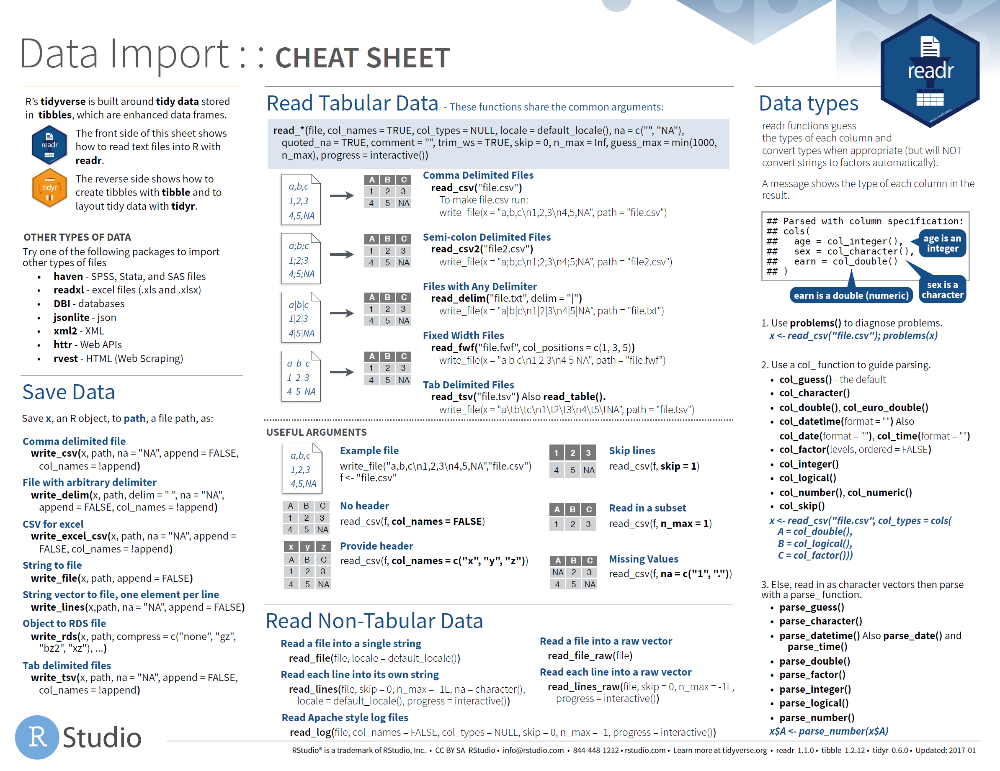
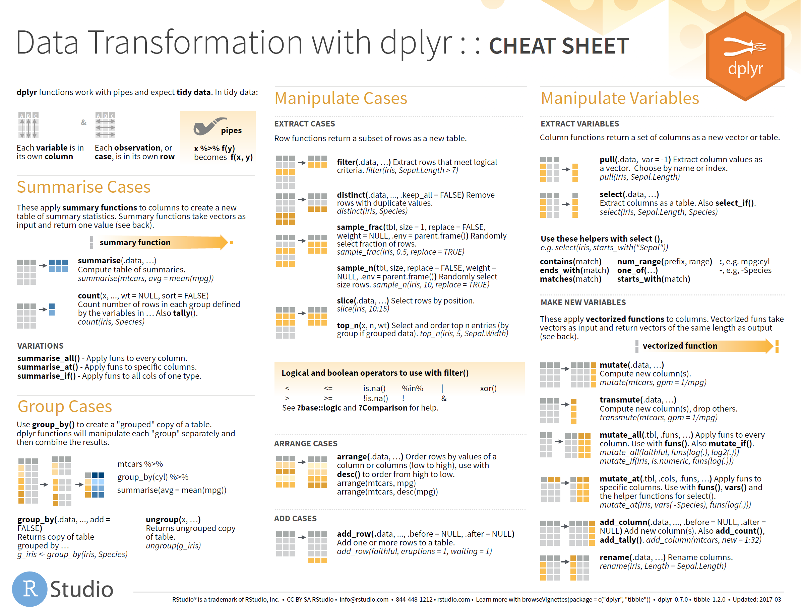
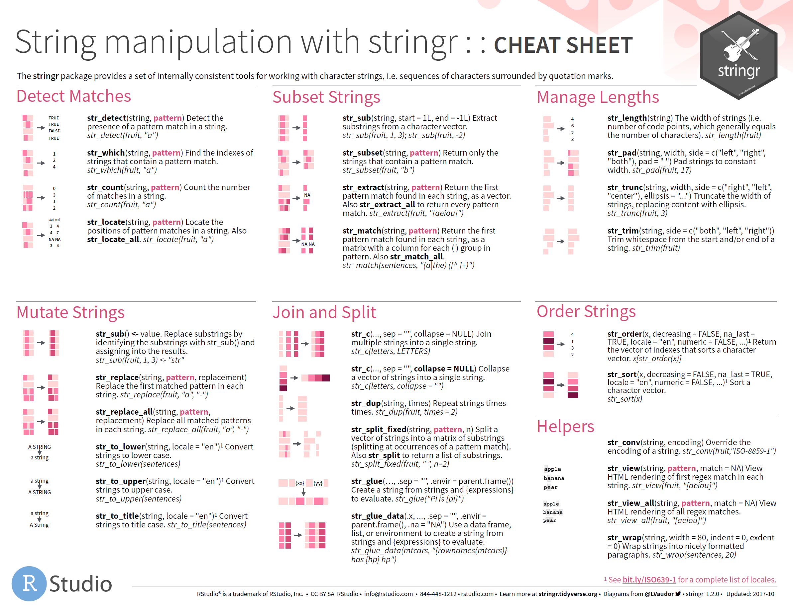
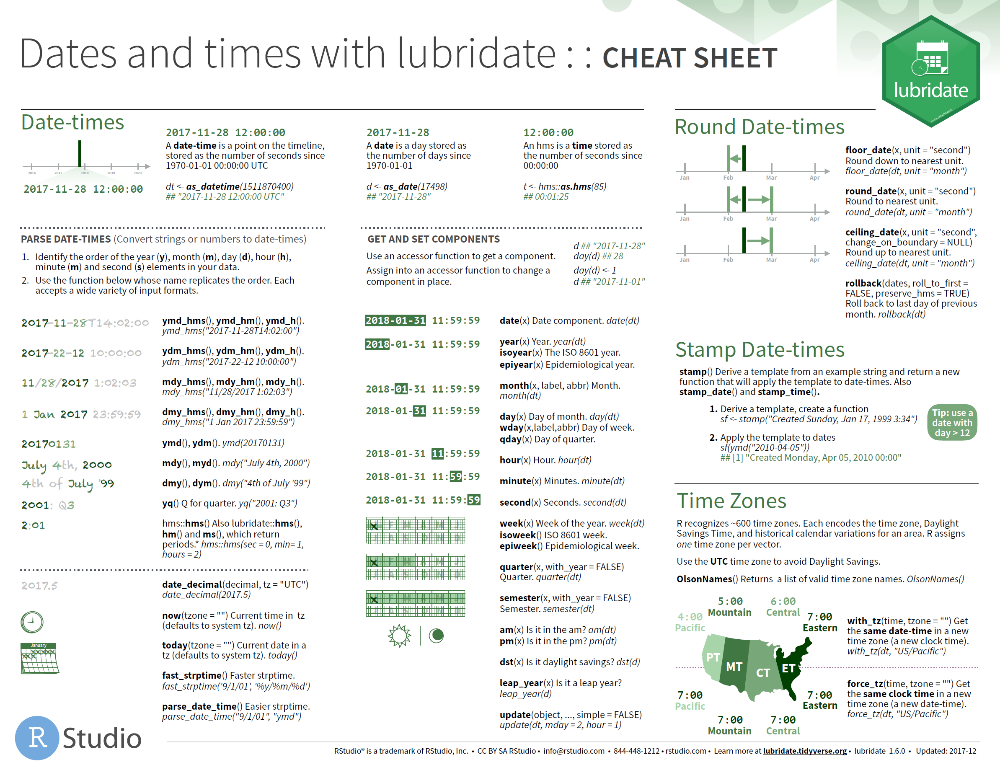
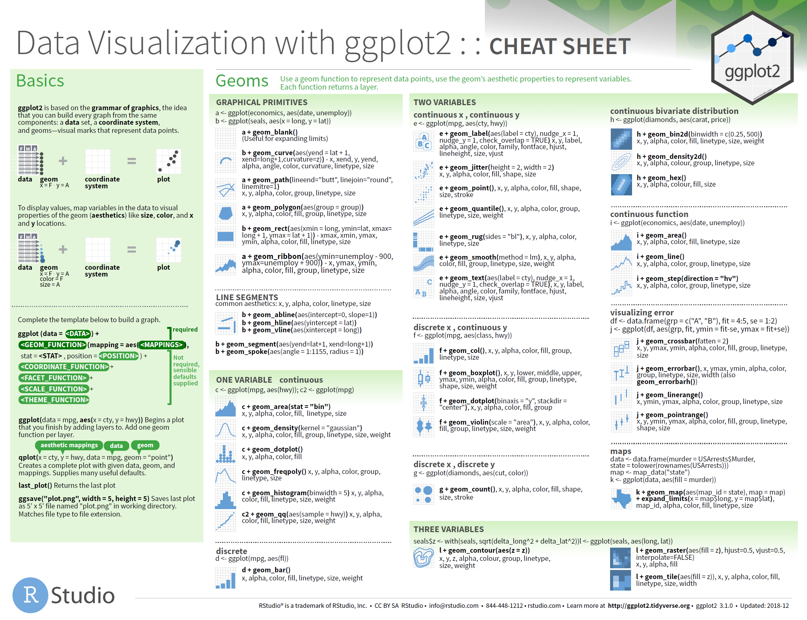
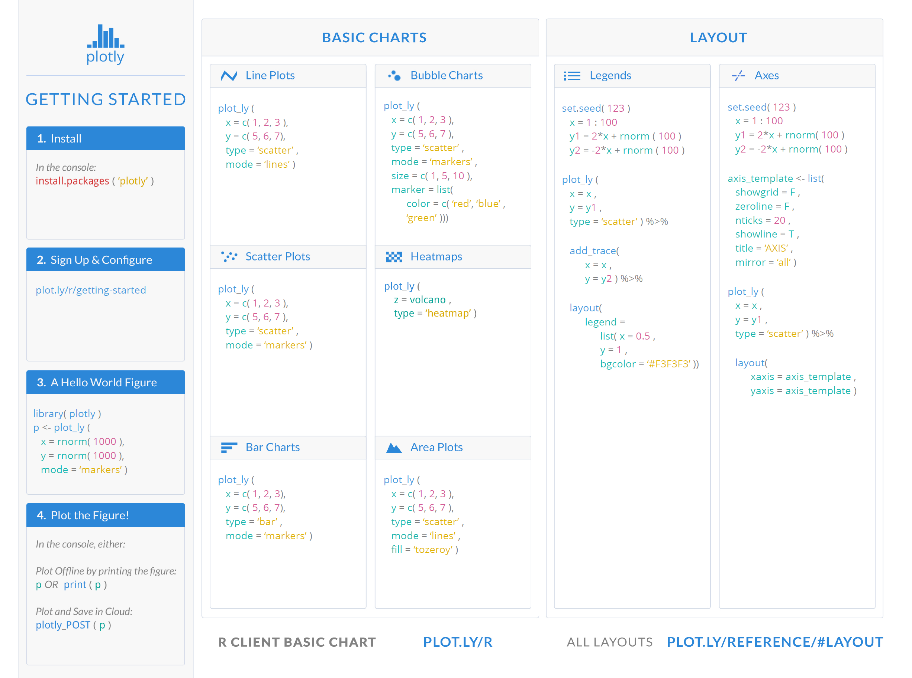

# Recommended Packages {#packages}

## Data Wrangling

> Data wrangling is the process of transforming and mapping data from one "raw" data form 
> into another format with the intent of making it more appropriate and valuable for a 
> variety of downstream purposes such as analytics.
>
> -- [_Wikipedia_](https://en.wikipedia.org/wiki/Data_wrangling)

### Tidy Data

The Tidyverse of packages are built around the concept of tidy data, first introduced by 
Jeff Leek in his book _The Elements of Data Analytic Style_. Hadley Wickham summarises the 
characteristics of [tidy data](http://tidyr.tidyverse.org/articles/tidy-data.html) with 
the following points:

 1. Each variable forms a column.
 2. Each observation forms a row.
 3. Each type of observational unit forms a table.

### Importing Data

The first step in wrangling is importing the data into R. The methods to do so depend on the 
source of data:

 - Reading files
 - Connecting to databases
 - Web APIs or pages

#### Reading Files

Files may come in many formats and R has packages to read many of them. The most common 
for data science are tabular text files, such as CSVs, and Excel spreadsheets. The 
recommended packages for reading these files are:.

 - [`readr`](http://readr.tidyverse.org/) for reading text files
 - [`readxl`](http://readxl.tidyverse.org/) for reading Excel files
 - [`openxlsx`](https://www.rdocumentation.org/packages/openxlsx/) for writing to Excel 
   files

For more detail, read the [Data Import](https://r4ds.had.co.nz/data-import.html) chapter in 
the _R for Data Science_ book or use the cheatsheet below for reference.

#### Tibbles

When using the Tidyverse packages you may notice they return a `tibble` rather than a 
`data.frame` They are basically the same thing except construction and subsetting are more
consistent. They also display nicely when printed to the console. The package 
[`tibble`](http://tibble.tidyverse.org/) has some useful functions for constructing tibbles.

For more detail, read the [Tibbles](https://r4ds.had.co.nz/tibbles.html) chapter in the 
_R for Data Science_ book or use the _Data Import_ cheatsheet above for reference.

#### Connecting to Databases

The [RStudio Connections Pane](https://db.rstudio.com/rstudio/connections/) makes it possible 
to easily connect to a variety of data sources, and explore the objects and data inside the 
connection.

The recommended packages for connecting to databases (also used by RStudio) are:

 - [`DBI`](https://db.rstudio.com/DBI) provides a standard interface to any database
 - [`odbc`](https://db.rstudio.com/odbc/) for connecting to databases using ODBC
 - [`dplyr`](https://db.rstudio.com/dplyr/) for transforming tables in a database

For more detail, read the [Databases using R](https://db.rstudio.com/) website by RStudio.

#### Web APIs and Pages

Obtaining data from the internet has two main approaches. If the website provides an
application programming interface (API) then you can send and receive data through it.
The data from web APIs is usually returned in JSON or XML format. Alternatively, you can
scrape the website itself, extracting data from the pages. The recommended packages for 
these approaches are:

 - [`httr`](http://httr.r-lib.org/) for communicating with web APIs
 - [`jsonlite`](https://www.rdocumentation.org/packages/jsonlite) for reading JSON 
   formatted text
 - [`xml2`](https://www.rdocumentation.org/packages/xml2) for reading XML formatted text
 - [`rvest`](https://www.rdocumentation.org/packages/rvest) for scraping 
   web pages

### Transforming Data

Now you have the data you want, it probably requires some processing in order to get it
into a structure that is useful for analysis. There are two main packages for this 
[`tidyr`](http://tidyr.tidyverse.org) and [`dplyr`](http://dplyr.tidyverse.org)

#### Tidying Data

The focus of [`tidyr`](http://tidyr.tidyverse.org) is to get the data into a tidy format. 
It provides functions for reshaping the data, as well as dealing with implicit and explicit
missing values.

For more detail, read the [Tidy Data](https://r4ds.had.co.nz/tidy-data.html) chapter in 
the _R for Data Science_ book or use the _Data Import_ cheatsheet above for reference.

#### Manipulating Data

[`dplyr`](http://dplyr.tidyverse.org) is a grammar of data manipulation, providing a
consistent set of verbs that help you solve the most common data manipulation challenges. For 
example; Calculating a new variable (or column) based on existing ones, selecting columns, 
filtering tables and summarising them by groups. [`dplyr`](http://dplyr.tidyverse.org) also 
provides a set of functions for combining tables.

For more detail, read the [Data Transformation](https://r4ds.had.co.nz/transform.html) chapter in 
the _R for Data Science_ book or use the cheatsheet below for reference.

#### Variable Types

There are also packages which simplify working with specific types of data:

 - [`stringr`](http://stringr.tidyverse.org/) for strings and regular expressions
 - [`forcats`](http://forcats.tidyverse.org/) for factors, used to handle categorical data
 - [`lubridate`](http://lubridate.tidyverse.org/) for dates and date-times.
 - [`hms`](https://www.rdocumentation.org/packages/hms) for time-of-day values.

For more detail, read the [Strings](https://r4ds.had.co.nz/strings.html), 
[Factors](https://r4ds.had.co.nz/factors.html), or 
[Dates and Times](https://r4ds.had.co.nz/dates-and-times.html) chapters in the 
_R for Data Science_ book or use the cheatsheets below for reference.

## Visualising Data

When it comes to visualising data the most commonly used package is 
[`ggplot2`](https://ggplot2.tidyverse.org/). [`ggplot2`](https://ggplot2.tidyverse.org/)
only produces static plots, which is great if you want to insert it into a report, but if you want 
to create interactive graphs in a web page use the [`plotly`](https://plot.ly/r/) package.

### Grammer of Graphics

The [`ggplot2`](https://ggplot2.tidyverse.org/) package is based on the grammer of graphics which 
allows you to create plots by adding layers of geometric objects, e.g. point, lines, etc, with 
aesthetics mapped to variables, e.g. coordinates, size, etc. This framework allows for highly 
customisable plots.

For more detail, read the [Data Visualisation](https://r4ds.had.co.nz/data-visualisation.html)
chapter in the _R for Data Science_ book or use the cheatsheet below for reference.

### Interactive Graphics

If you want to add a plot to a web page then you'll probably want something more interactive. 
[`plotly`](https://plot.ly/r/) produces high-quality graphics with the ability to zoom, pan and 
add tool-tips, etc.

For more detail, read the [Plotly for R](https://plotly-book.cpsievert.me/) book or use the
cheatsheet below for reference.

