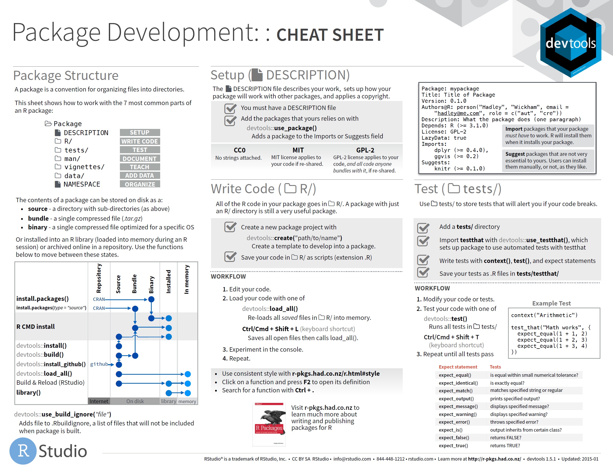
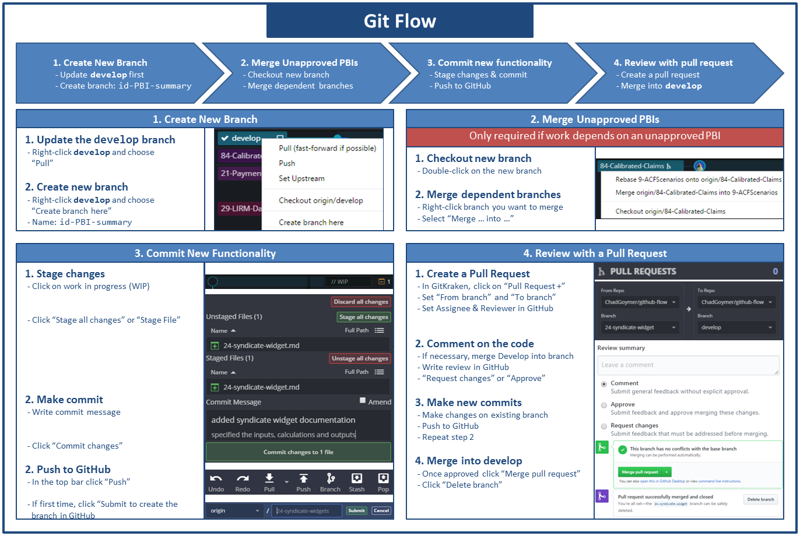

# Development Practices {#development}


## Package Development

If you have functions or code that is used across projects then the best practice is to build a 
package. A package combines a set of related functionality which can then be shared easily 
between projects and other users. The package [`devtools`](http://devtools.r-lib.org/) makes 
package development straight forward. For more detailed information about creating packages, read
the [R Packages](http://r-pkgs.had.co.nz/) book or use the cheatsheet below for reference.

[](https://rawgit.com/rstudio/cheatsheets/master/package-development.pdf)


NOTE: [`devtools`](http://devtools.r-lib.org/) is currently being split up into smaller packages 
and the above book and cheatsheet are slightly out of date.

Package development has a formal structure, which addresses many of the areas detailed in the 
End-User Computing standards. The package [`usethis`](https://usethis.r-lib.org) provides 
functions to ease the setup of the package structure. To set up an empty package use:

```r
usethis::create_package("pkgname")
```

Functions you wish to add to the package are saved in scripts in the `R` subfolder that has been
created.


### Documentation

Documentation comes in three flavours in an R package. The DESCRIPTION file details the package 
itself including author and dependencies; help files contains documentation for each function in 
the package; and vignettes are small articles describing how to use the functions in practice.

#### DESCRIPTION

The function `usethis::create_package()` creates the basic structure of the package and a 
placeholder DESCRIPTION file. You can then edit it manually or use other functions in the 
[`usethis`](https://usethis.r-lib.org) package to update it.

For more detail, read the [Package metadata](http://r-pkgs.had.co.nz/description.html) chapter in 
the _R Packages_ book.


#### Help Files

When writing a function in a package it is good practice to document it, so a user can see how it
works with `help("function_name")`. Documenting a package is as straight forward as including a 
special commented section before the function definition. The package 
[`roxygen2`](https://www.rdocumentation.org/packages/roxygen2) is then used to convert those 
comments into help files.

For more detail, read the [Object documentation](http://r-pkgs.had.co.nz/man.html) chapter in 
the _R Packages_ book.


#### Vignettes

When writing a package, it is also good practice to write a short article explaining how to use 
it. If the package is complex it may require a number articles describing different aspects. These
short articles are called vignettes. Vignettes are written in markdown format and stored in a
`vignettes` subfolder.

For more detail, read the [Vignettes](http://r-pkgs.had.co.nz/vignettes.html) chapter in 
the _R Packages_ book.


### Testing

R packages provide a structure for specifying tests that allows you easily re-run all tests and 
determine whether something has broken. The package [`testthat`](http://testthat.r-lib.org/) 
provides functions for specifying tests and comparing the results with expectations.

For more detail, read the [Testing](http://r-pkgs.had.co.nz/tests.html) chapter in 
the _R Packages_ book.


## Version Control

### Git

### Git Flow

[](images/git-cheat-sheet.png)

### GitHub Flow


## Managing Package Dependencies
