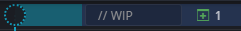
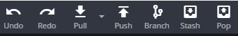
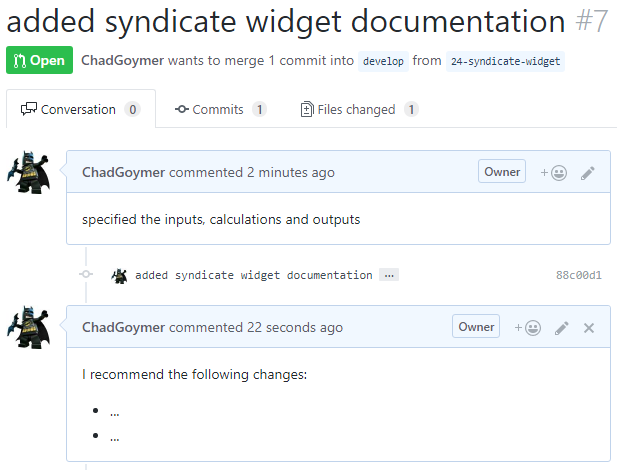
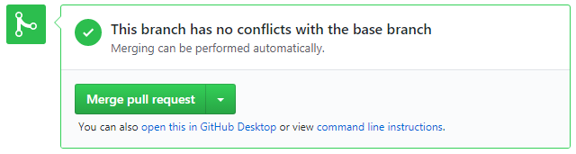
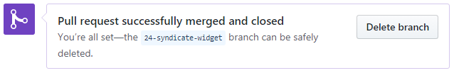
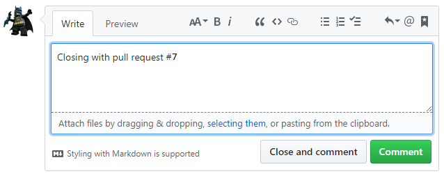

# Development Practices {#development}


## Package Development

If you have functions or code that is used across projects then the best practice is to build a 
package. A package combines a set of related functionality which can then be shared easily 
between projects and other users. The package [`devtools`](http://devtools.r-lib.org/) makes 
package development straight forward. For more detailed information about creating packages, read
the [R Packages](http://r-pkgs.had.co.nz/) book or use the cheatsheet below for reference.

[](https://rawgit.com/rstudio/cheatsheets/master/package-development.pdf)


NOTE: [`devtools`](http://devtools.r-lib.org/) is currently being split up into smaller packages 
and the above book and cheatsheet are slightly out of date.

Package development has a formal structure, which addresses many of the areas detailed in the 
End-User Computing standards. The package [`usethis`](https://usethis.r-lib.org) provides 
functions to ease the setup of the package structure. To set up an empty package use:

```r
usethis::create_package("pkgname")
```

Functions you wish to add to the package are saved in scripts in the `R` subfolder that has been
created.


### Documentation

Documentation comes in three flavours in an R package. The DESCRIPTION file details the package 
itself including author and dependencies; help files contains documentation for each function in 
the package; and vignettes are small articles describing how to use the functions in practice.

#### DESCRIPTION

The function `usethis::create_package()` creates the basic structure of the package and a 
placeholder DESCRIPTION file. You can then edit it manually or use other functions in the 
[`usethis`](https://usethis.r-lib.org) package to update it.

For more detail, read the [Package metadata](http://r-pkgs.had.co.nz/description.html) chapter in 
the _R Packages_ book.


#### Help Files

When writing a function in a package it is good practice to document it, so a user can see how it
works with `help("function_name")`. Documenting a package is as straight forward as including a 
special commented section before the function definition. The package 
[`roxygen2`](https://www.rdocumentation.org/packages/roxygen2) is then used to convert those 
comments into help files.

For more detail, read the [Object documentation](http://r-pkgs.had.co.nz/man.html) chapter in 
the _R Packages_ book.


#### Vignettes

When writing a package, it is also good practice to write a short article explaining how to use 
it. If the package is complex it may require a number articles describing different aspects. These
short articles are called vignettes. Vignettes are written in markdown format and stored in a
`vignettes` subfolder.

For more detail, read the [Vignettes](http://r-pkgs.had.co.nz/vignettes.html) chapter in 
the _R Packages_ book.


### Testing

R packages provide a structure for specifying tests that allows you easily re-run all tests and 
determine whether something has broken. The package [`testthat`](http://testthat.r-lib.org/) 
provides functions for specifying tests and comparing the results with expectations.

For more detail, read the [Testing](http://r-pkgs.had.co.nz/tests.html) chapter in 
the _R Packages_ book.


## Version Control

### Git

### Git Flow

[](images/git-cheat-sheet.png)

**Workflow summary**

At a high level the development workflow follows the following steps:

1. Create a new branch
2. Merge unapproved PBIs (if required)
3. Commit new functionality
4. Review with a pull request

**1. Create a new branch**

1. Update the `develop` branch
2. Create a new branch: `<issue-id>-<feature-summary>`

**In GitKraken:**

1. Double-click the `develop` branch to check it out:

[](images/checkout-branch.png)

2. Click `Pull`:

[](images/click-pull.png)

3. Right-click the `develop` branch and click `Create branch here`:

[](images/create-branch.png)

4. Enter a branch name in the format `<issue-id>-<feature-summary>`, e.g. `24-syndicate-widget`.


**2. Merge unapproved PBIs**

Note: This step is only required if your PBI depends on another PBI which has not yet been approved. Since the dependency will not yet exist in the develop branch you will need to bring the changes in separately. This does introduce a risk that the dependency could change while you are developing, but this should be mitigated by merging the develop branch in again once the dependent PBI has been approved.

1. Checkout the new branch
2. Merge dependent branches

**In GitKraken:**

1. Double-click the branch name to check out
2. Right-click the dependent branch name and select `Merge ... into ...`

[](images/merge-into.png)

Repeat step 2 for all PBIs the current work depends on.


**3. Commit new functionality**

As the new feature is developed make commits as appropriate. You should make at least separate commits for documentation, tests and code.

For more information about developing new functionality read the wiki pages on [Node Documentation](http://github/CCK/Model/wiki/Node-Documentation), [Node Testing](http://github/CCK/Model/wiki/Node-Testing), [Tyche Coding Standards](http://github/CCK/Model/wiki/Tyche-Coding-Standards) and [Naming Conventions](http://github/CCK/Model/wiki/Naming-Conventions).

1. Stage changes
2. Make a commit
3. Push to GitHub

**In GitKraken:**

1. Click on the `WIP` bar at the top of the central window:

[](images/wip.png)

2. Click `Stage all changes` or stage individual files in the right-hand window:

[](images/stage-changes.png)

3. Write a commit message and click `Commit changes`:

[](images/staged-files.png)

4. Click `Push` in the top bar:

[](images/push.png)

5. If it is the first time pushing to GitHub from the branch you will have to set the remote branch:

[](images/set-remote.png)


**4. Review with a Pull Request**

For more information on peer reviewing visit the wiki page [Review Process](http://github/CCK/Model/wiki/Review-Process).

1. Create a pull request and request someone's review
2. Comment on the code in the pull request
3. Make new commits/request changes as appropriate
4. Merge into `develop` when complete

**In GitKraken:**

1. In the left-hand window, click on the `+` in `PULL REQUESTS`:

[](images/pull-request.png)

2. Set the repository and branch to pull from and the repository and branch to merge into:

[](images/create-pull-request.png)

Specify the PBI the feature addresses by writing `resolves #` in the description (this will also automatically close the issue once merged). You can also request someone's review by adding `@` e.g. `@WalkerC`.

**In GitHub:**

3. The reviewer comments on the changes and/or requests a change:

[](images/reviewer-comment.png)

4. The developer or reviewer can make new commits as appropriate:

[](images/reviewer-commit.png)

If the develop branch has moved on and you want to test how the current work interacts with a newly published work you can merge the develop branch into the new branch.

Right-click the develop branch and select `Merge develop into ...`:

[](images/merge-develop.png)

5. Once review is complete, click `Merge pull request` and confirm:

[](images/merge-pull-request.png)

6. Click `Delete branch`:

[](images/delete-branch.png)

7. Close the issue

If you have not used `resolves #` in the pull request description, you will need to close the issue manually. Go to the issues page of the repository, enter a comment referencing the pull request and click `Close and comment`:

[](images/close-issue.png)


### GitHub Flow


## Managing Package Dependencies
