# Development Practices {#development}

## Package Development

If you have functions or code that is used across projects then the best practice is to build a package. A package combines a set of related functionality which can then be shared easily between projects and other users. The package [`devtools`](http://devtools.r-lib.org/) makes package development straight forward. For more detailed information about creating packages, read the [R Packages](http://r-pkgs.had.co.nz/) book or use the cheatsheet below for reference.

[](https://rawgit.com/rstudio/cheatsheets/master/package-development.pdf)

NOTE: [`devtools`](http://devtools.r-lib.org/) is currently being split up into smaller packages and the above book and cheatsheet are slightly out of date.

Package development has a formal structure, which addresses many of the areas detailed in the End-User Computing standards. The package [`usethis`](https://usethis.r-lib.org) provides functions to ease the setup of the package structure. To set up an empty package use:

``` r
usethis::create_package("pkgname")
```

Functions you wish to add to the package are saved in scripts in the `R` subfolder that has been created.

### Documentation

Documentation comes in three flavours in an R package. The DESCRIPTION file details the package itself including author and dependencies; help files contains documentation for each function in the package; and vignettes are small articles describing how to use the functions in practice.

#### DESCRIPTION

The function `usethis::create_package()` creates the basic structure of the package and a placeholder DESCRIPTION file. You can then edit it manually or use other functions in the [`usethis`](https://usethis.r-lib.org) package to update it.

For more detail, read the [Package metadata](http://r-pkgs.had.co.nz/description.html) chapter in the *R Packages* book.

#### Help Files

When writing a function in a package it is good practice to document it, so a user can see how it works with `help("function_name")`. Documenting a package is as straight forward as including a special commented section before the function definition. The package [`roxygen2`](https://www.rdocumentation.org/packages/roxygen2) is then used to convert those comments into help files.

For more detail, read the [Object documentation](http://r-pkgs.had.co.nz/man.html) chapter in the *R Packages* book.

#### Vignettes

When writing a package, it is also good practice to write a short article explaining how to use it. If the package is complex it may require a number articles describing different aspects. These short articles are called vignettes. Vignettes are written in markdown format and stored in a `vignettes` subfolder.

For more detail, read the [Vignettes](http://r-pkgs.had.co.nz/vignettes.html) chapter in the *R Packages* book.

### Testing

R packages provide a structure for specifying tests that allows you easily re-run all tests and determine whether something has broken. The package [`testthat`](http://testthat.r-lib.org/) provides functions for specifying tests and comparing the results with expectations.

For more detail, read the [Testing](http://r-pkgs.had.co.nz/tests.html) chapter in the *R Packages* book.

## Version Control

### Git

Below is a list of dos and don'ts to help navigate Git.

**Do:**

-   Create a Git repository for every new project
-   Always create a new branch for every new feature and bug
-   Regularly commit and push changes to the remote branch to avoid loss of work
-   Include a gitignore file in your project to avoid unwanted files being committed
-   Always commit changes with a concise and useful commit message
-   Keep your branch up to date with development branches
-   Follow a workflow like Gitflow (expanded on below)
-   Always create a pull request for merging changes from one branch to another
-   Always create one pull request addressing one issue
-   Always review your code once by yourself before creating a pull request
-   Have more than one person review a pull request. It's not necessary, but is a best practice
-   Enforce standards by using pull request templates and adding continuous integrations
-   Merge changes from the release branch to master after each release
-   Tag the master sources after every release
-   Delete branches if a feature or bug fix is merged to its intended branches and the branch is no longer required

**Don't:**

-   Don't commit directly to the master or development branches
-   Don't hold up work by not committing local branch changes to remote branches
-   Don't commit large files in the repository. This will increase the size of the repository. Use Git LFS for large files
-   Don't create one pull request addressing multiple issues
-   Don't work on multiple issues in the same branch. If a feature is dropped, it will be difficult to revert changes
-   Don't reset a branch without committing/stashing your changes. If you do so, your changes will be lost
-   Don't do a force push until you're extremely comfortable performing this action
-   Don't modify or delete public history

### GitHub Flow

GitHub flow is a lightweight, branch-based workflow that supports teams and projects where deployments are made regularly. It is similar to Git flow but without a `develop` branch.

1.  Create a branch
2.  Add commits
3.  Open a pull request
4.  Discuss and review code
5.  Deploy/Test
6.  Merge

**1. Create a branch**

[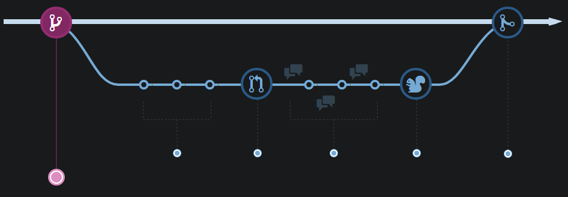](images/step-one-branch.png)

When you're working on a project, you're going to have a bunch of different features or ideas in progress at any given time -- some of which are ready to go, and others which are not. Branching exists to help you manage this workflow.

When you create a branch in your project, you're creating an environment where you can try out new ideas. Changes you make on a branch don't affect the `master` branch, so you're free to experiment and commit changes, safe in the knowledge that your branch won't be merged until it's ready to be reviewed by someone you're collaborating with.

**2. Add commits**

[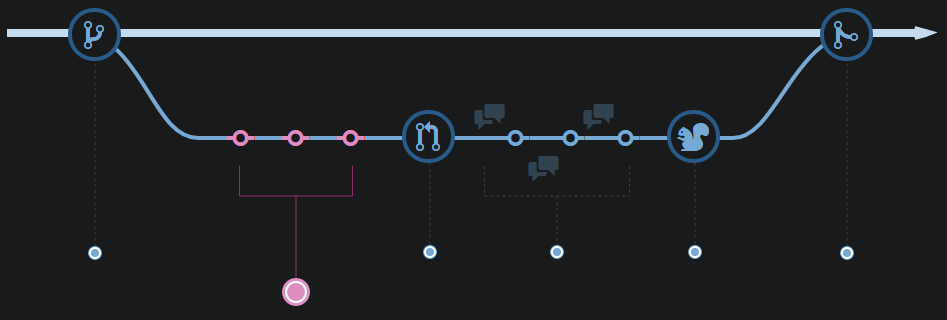](images/step-two-commit.png)

Once your branch has been created, it's time to start making changes. Whenever you add, edit, or delete a file, you're making a commit, and adding them to your branch. This process of adding commits keeps track of your progress as you work on a feature branch.

Commits also create a transparent history of your work that others can follow to understand what you've done and why. Each commit has an associated commit message, which is a description explaining why a particular change was made. Furthermore, each commit is considered a separate unit of change. This lets you roll back changes if a bug is found, or if you decide to head in a different direction.

**3. Open a Pull Request**

[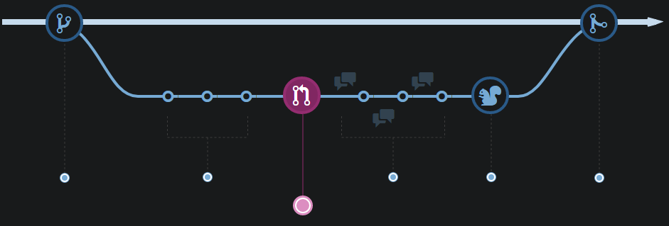](images/step-three-pull.png)

Pull Requests initiate discussion about your commits. Because they're tightly integrated with the underlying Git repository, anyone can see exactly what changes would be merged if they accept your request.

You can open a Pull Request at any point during the development process: when you have little or no code but want to share some screenshots or general ideas, when you're stuck and need help or advice, or when you're ready for someone to review your work. By using GitHub's `@mention` system in your Pull Request message, you can ask for feedback from specific people or teams, whether they're down the hall or ten time zones away.

**4. Discuss and review code**

[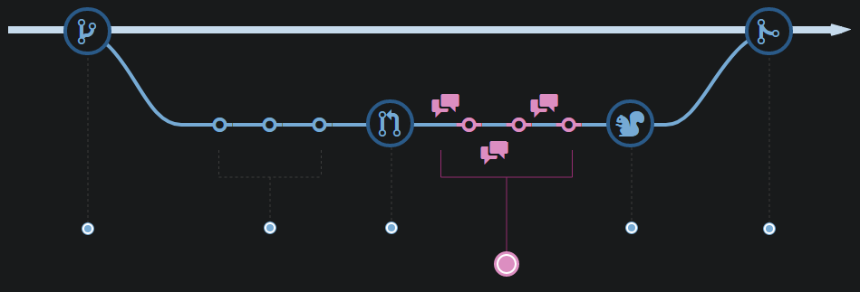](images/step-four-review.png)

Once a Pull Request has been opened, the person or team reviewing your changes may have questions or comments. Perhaps the coding style doesn't match project guidelines, the change is missing unit tests, or maybe everything looks great and props are in order. Pull Requests are designed to encourage and capture this type of conversation.

You can also continue to push to your branch in light of discussion and feedback about your commits. If someone comments that you forgot to do something or if there is a bug in the code, you can fix it in your branch and push up the change. GitHub will show your new commits and any additional feedback you may receive in the unified Pull Request view.

**5. Deploy/Test**

[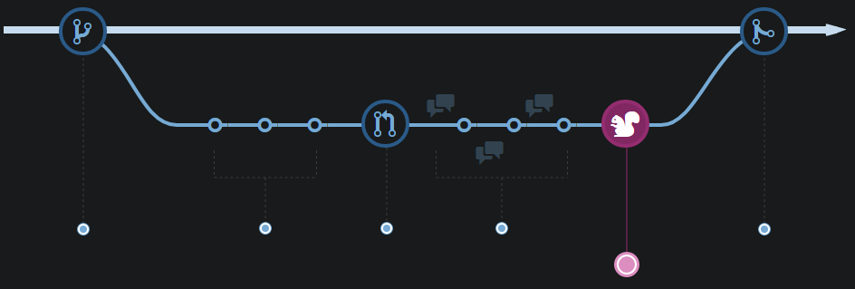](images/step-five-test.png)

With GitHub, you can deploy from a branch for final testing in production before merging to master.

Once your pull request has been reviewed and the branch passes your tests, you can deploy your changes to verify them in production. If your branch causes issues, you can roll it back by deploying the existing master into production.

**6. Merge**

[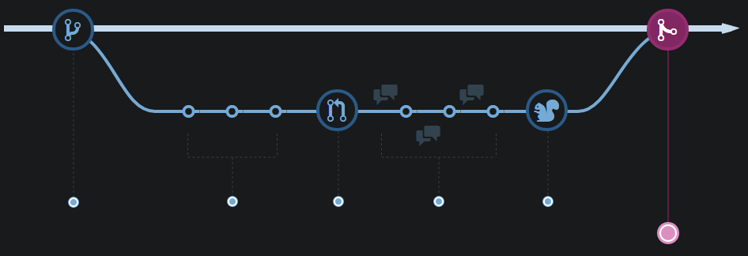](images/step-six-merge.png)

Now that your changes have been verified in production, it is time to merge your code into the master branch.

Once merged, Pull Requests preserve a record of the historical changes to your code. Because they're searchable, they let anyone go back in time to understand why and how a decision was made.

### Git Flow

Git flow is similar to GitHub flow, but with the addition of a `develop` branch.

[](images/git-cheat-sheet.png)

**Workflow summary**

At a high level the development workflow follows the following steps:

1.  Create a new branch
2.  Merge unapproved PBIs (if required)
3.  Commit new functionality
4.  Review with a pull request

**1. Create a new branch**

1.  Update the `develop` branch
2.  Create a new branch: `<issue-id>-<feature-summary>`

**In GitKraken:**

1.  Double-click the `develop` branch to check it out:

[](images/checkout-branch.png)

2.  Click `Pull`:

[](images/click-pull.png)

3.  Right-click the `develop` branch and click `Create branch here`:

[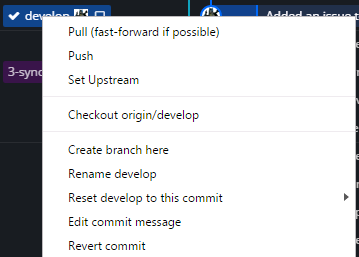](images/create-branch.png)

4.  Enter a branch name in the format `<issue-id>-<feature-summary>`, e.g. `24-syndicate-widget`.

**2. Merge unapproved PBIs**

Note: This step is only required if your PBI depends on another PBI which has not yet been approved. Since the dependency will not yet exist in the develop branch you will need to bring the changes in separately. This does introduce a risk that the dependency could change while you are developing, but this should be mitigated by merging the develop branch in again once the dependent PBI has been approved.

1.  Checkout the new branch
2.  Merge dependent branches

**In GitKraken:**

1.  Double-click the branch name to check out
2.  Right-click the dependent branch name and select `Merge ... into ...`

[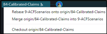](images/merge-into.png)

Repeat step 2 for all PBIs the current work depends on.

**3. Commit new functionality**

As the new feature is developed make commits as appropriate. You should make at least separate commits for documentation, tests and code.

For more information about developing new functionality read the wiki pages on [Node Documentation](http://github/CCK/Model/wiki/Node-Documentation), [Node Testing](http://github/CCK/Model/wiki/Node-Testing), [Tyche Coding Standards](http://github/CCK/Model/wiki/Tyche-Coding-Standards) and [Naming Conventions](http://github/CCK/Model/wiki/Naming-Conventions).

1.  Stage changes
2.  Make a commit
3.  Push to GitHub

**In GitKraken:**

1.  Click on the `WIP` bar at the top of the central window:

[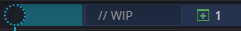](images/wip.png)

2.  Click `Stage all changes` or stage individual files in the right-hand window:

[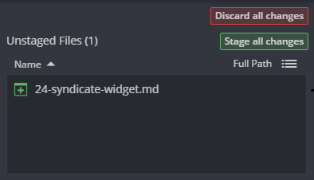](images/stage-changes.png)

3.  Write a commit message and click `Commit changes`:

[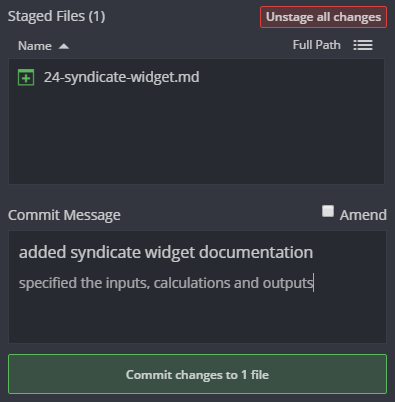](images/staged-files.png)

4.  Click `Push` in the top bar:

[](images/push.png)

5.  If it is the first time pushing to GitHub from the branch you will have to set the remote branch:

[](images/set-remote.png)

**4. Review with a Pull Request**

For more information on peer reviewing visit the wiki page [Review Process](http://github/CCK/Model/wiki/Review-Process).

1.  Create a pull request and request someone's review
2.  Comment on the code in the pull request
3.  Make new commits/request changes as appropriate
4.  Merge into `develop` when complete

**In GitKraken:**

1.  In the left-hand window, click on the `+` in `PULL REQUESTS`:

[](images/pull-request.png)

2.  Set the repository and branch to pull from and the repository and branch to merge into:

[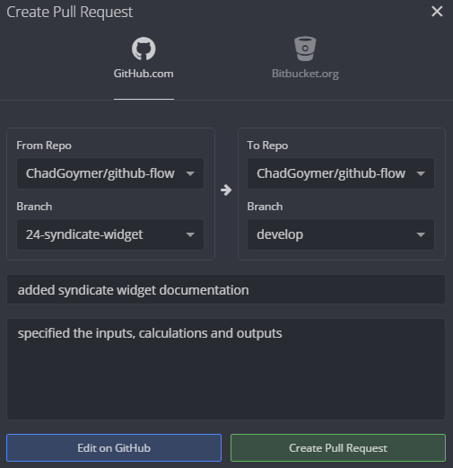](images/create-pull-request.png)

Specify the PBI the feature addresses by writing `resolves #` in the description (this will also automatically close the issue once merged). You can also request someone's review by adding `@` e.g. `@WalkerC`.

**In GitHub:**

3.  The reviewer comments on the changes and/or requests a change:

[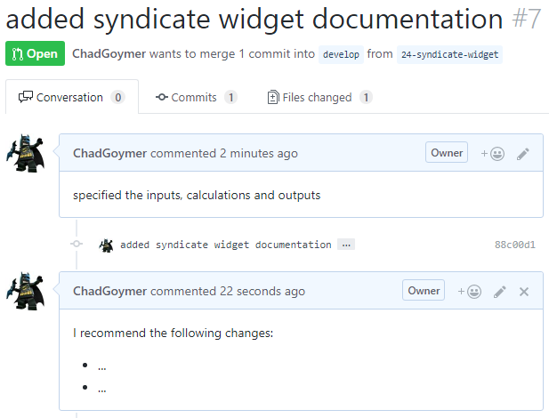](images/reviewer-comment.png)

4.  The developer or reviewer can make new commits as appropriate:

[](images/reviewer-commit.png)

If the develop branch has moved on and you want to test how the current work interacts with a newly published work you can merge the develop branch into the new branch.

Right-click the develop branch and select `Merge develop into ...`:

[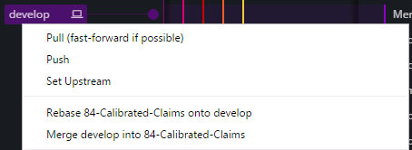](images/merge-develop.png)

5.  Once review is complete, click `Merge pull request` and confirm:

[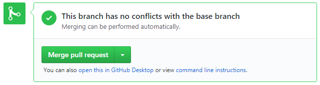](images/merge-pull-request.png)

6.  Click `Delete branch`:

[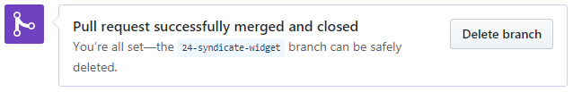](images/delete-branch.png)

7.  Close the issue

If you have not used `resolves #` in the pull request description, you will need to close the issue manually. Go to the issues page of the repository, enter a comment referencing the pull request and click `Close and comment`:

[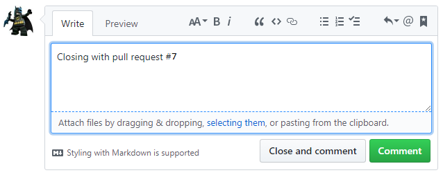](images/close-issue.png)

### GitKraken

Commit messages are important, especially since Git tracks your changes and then displays them as commits once they're pushed to the server. By writing clear commit messages, you can make it easier for other people to follow along and provide feedback. Commit messages like "minor changes" are **not** helpful and should be avoided, especially in the `Data` repositories where the commits are viewed by Auditors.

**Merge vs. Rebase**

There are two ways to integrate changes from one branch into another branch - `Merge` and `Rebase`.

The first thing to understand about `git rebase` is that it solves the same problem as `git merge`. Both of these commands are designed to integrate changes from one branch into another branch --- they just do it in very different ways.

Consider what happens when you start working on a new feature in a dedicated branch, then another team member updates the `master` branch with new commits.

[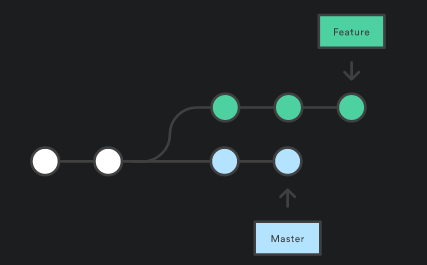](images/forked-history.png)

Now, let's say that the new commits in master are relevant to the feature that you're working on. To incorporate the new commits into your `feature` branch, you have two options: merging or rebasing.

**Merge**

The easiest option is to merge the `master` branch into the `feature` branch.

1.  Checkout the `feature` branch
2.  Right-click the `feature` branch
3.  Merge `master` into `...`
4.  Resolve any conflicts

This will create a merge commit on the `feature` branch that ties together the histories of both branches.

[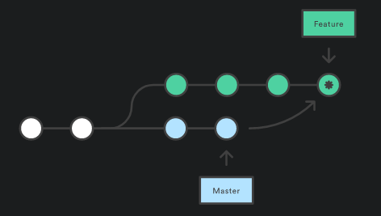](images/merge-commit.png)

Merging is nice because it's a *non-destructive* operation. The existing branches are not changed in any way. This avoids all of the potential pitfalls of rebasing (discussed below).

On the other hand, this also means that the feature branch will have an extraneous merge commit every time you need to incorporate upstream changes. If master is very active, this can pollute your feature branch's history quite a bit.

**Rebase**

As an alternative to merging, you can `rebase` the `feature` branch onto `master`.

1.  Checkout the `feature` branch
2.  Right click the `master` branch
3.  Rebase `...` onto `master`
4.  Resolve any conflicts

This moves the entire `feature` branch to begin on the tip of the `master` branch, effectively incorporating all of the new commits in master. But, instead of using a merge commit, rebasing re-writes the project history by creating brand new commits for each commit in the original branch.

[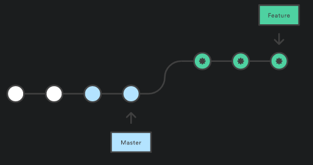](images/rebase.png)

The major benefit of rebasing is that you get a much cleaner project history, it eliminates the unnecessary merge commits required by `git merge`. You can follow the tip of feature all the way to the beginning of the project without any forks.

The main disadvantage of `git rebase` is that re-writing project history can be harmful to your collaboration workflow. Rebasing also loses the context provided by a merge commit - you can't see when upstream changes were incorporated into the feature.

## Managing Package Dependencies
